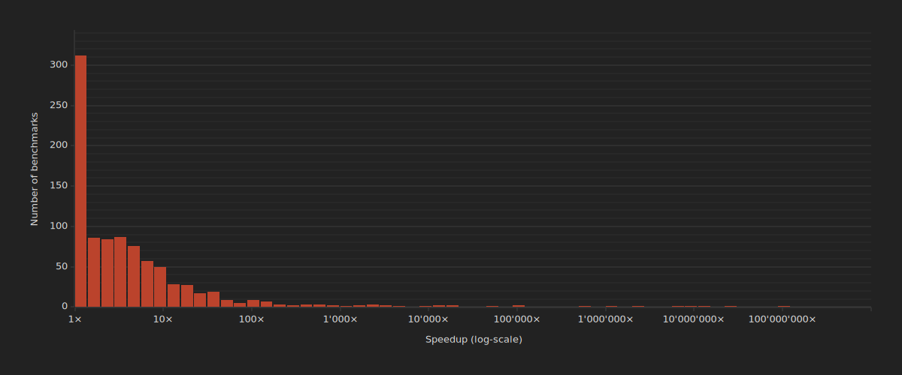
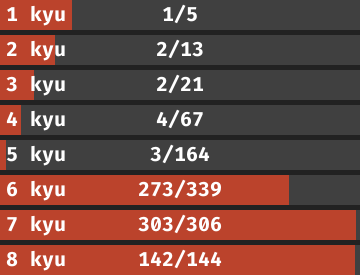

[](https://www.codewars.com/users/lincot)

# rusted katana

Highly optimized solutions to [Codewars](https://www.codewars.com/r/HLmVMg)
challenges, written in Rust. Runs the benchmark suite in **694×** less total
time than the most upvoted Rust solutions.



Current progress:



## rules

- every kata has benchmarks to easily compare solutions (more on it in the
[benchmarking section](#benchmarking))

- third-party libraries and libraries written in languages other than Rust
are allowed, even if they are not accepted by Codewars

- solutions are safe (more on it in the [safety section](#safety));
*nevertheless, there are 817 `unsafe` blocks*

- even though most of the tests on Codewars have only ASCII input,
they use Rust's standard UTF-8–encoded strings, so solutions for string katas
should work with Unicode input; *nevertheless, `.bytes()`, `.as_bytes()`,
`.as_bytes_mut()` and `.as_mut_vec()` are used 347 times*

- function signatures and names from solution setups are preserved;
*but are adjusted with clippy*

- various checking is done using [check.sh](./check.sh)

- large lookup tables are generally not allowed

## benchmarking

Every kata has benchmarks to easily compare solutions. In many cases, speedup
over a more naive solution is not constant, but often increases as the input
size increases. However, it would be impractical to measure this asymptotic
difference for every kata. Therefore, most katas are benchmarked with a single
representative input. For example, if input is an array, it is often benchmarked
with an array containing 1024 random elements, or fewer if the kata is
intended for small arrays. If there is a small set of possible inputs,
the kata is often benchmarked with all of those inputs, the worst-case input, or
the middle-case input. If it's a string kata and ASCII versus non-ASCII
makes a difference, both are benchmarked separately.

Each solution is compared with the most upvoted solution using our
[bench](./bench) tool. The tool fetches the most upvoted solution that passes
the tests and is not authored by rusted katana contributors. It then benchmarks
both solutions five times, taking the medians to calculate speedup, and writes
results to `benches/results.json`. This can be achieved by retrieving Codewars
session id from browser cookies and running the tool from the kata directory:

```sh
CODEWARS_SESSION_ID=your_session_id cargo run --package rusted-katana-bench --release
```

We use the standard `test` crate benchmarks for simplicity and faster execution.

Benchmarks are compiled targeting the native CPU.

## safety

Rusted katana solutions should not produce undefined behavior despite the heavy
use of `unsafe` blocks. All of the tests and benchmarks are run with miri as
part of the check script.

### allocating memory

A common pattern is to allocate enough memory for subsequent writes. The
capacity calculation should be checked, or a higher bound should be set for
operands, in case arithmetic operations are performed on arbitrary input.
Otherwise, it can lead to heap overflow attacks such as in the example below:

```rs
use core::time::Duration;
use std::{sync::Arc, thread};

fn main() {
    thread::spawn(work).join().unwrap();
}

fn work() {
    let a = Arc::new([0u8; 2]); // or Box or Vec

    thread::spawn(move || {
        println!("a is {a:?}");
        thread::sleep(Duration::from_secs(1));
        println!("a is {a:?}");
    });

    let n = usize::MAX - 16; // it could be user input
    #[allow(arithmetic_overflow)]
    let mut v = Vec::<u16>::with_capacity(n * (n + 16));
    for _ in 0..n {
        for _ in 0..n + 16 {
            let val = 17733; // could be user payload too
            unsafe {
                core::ptr::write(v.as_mut_ptr().add(v.len()), val);
                v.set_len(v.len() + 1);
            }
            thread::sleep(Duration::from_millis((v[0] % 8) as _));
        }
    }
}
```

Without overflow checks enabled this code prints:

```
a is [0, 0]
a is [69, 69]
Segmentation fault (core dumped)
```

An exception to this that doesn't have to be checked is summation performed on
lengths of existing allocations and small values such as

```rs
let v = Vec::with_capacity(some_str.len() + 35);
```

because allocations are capped at `isize::MAX` bytes, not just `usize::MAX`; so,
it's even allowed to multiply their lengths by two.
