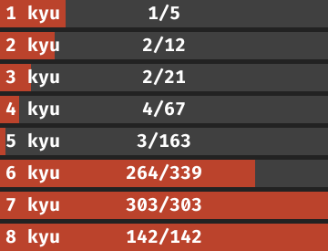

# rusted katana

fastest solutions to [Codewars](https://www.codewars.com/r/HLmVMg) challenges,
written in Rust

current progress:

## rules

- nontrivial katas have benchmarks to easily compare solutions

- third-party libraries and libraries written in languages other than Rust
are allowed, even if they are not accepted by Codewars

- solutions are safe, i.e. they don't produce undefined behavior
(checked with miri); *nevertheless, there are 533 `unsafe` blocks*

- even though most of the tests on Codewars have only ASCII input,
they use Rust's standard UTF-8–encoded strings,
so solutions for string katas are made for Unicode input;
*nevertheless,
`.bytes()`, `.as_bytes()`, `.as_bytes_mut()` and `.as_mut_vec()` are used 216 times*

- function signatures and names from solution setups are preserved;
*but are adjusted with clippy*

- linting is done with `./lint.sh`

- large lookup tables are generally not allowed
